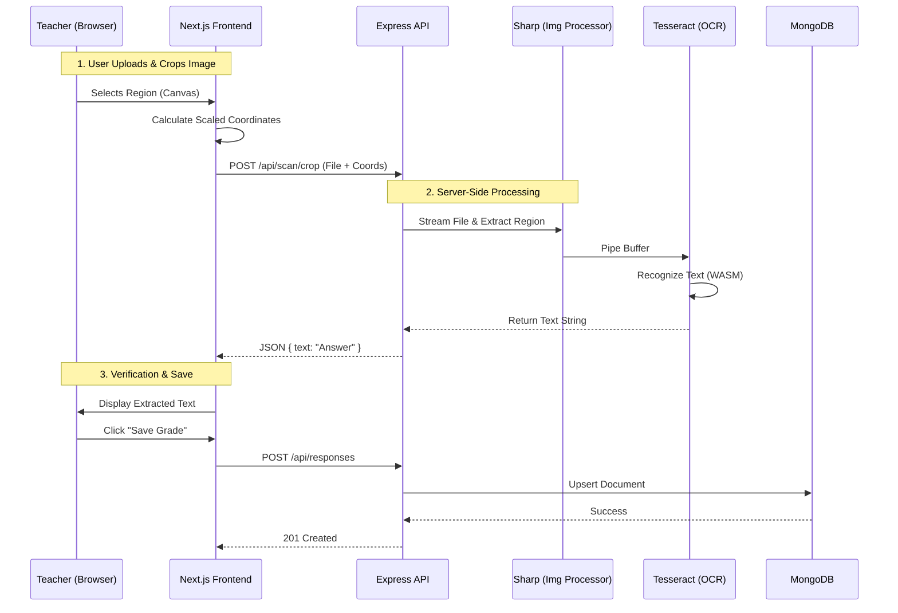
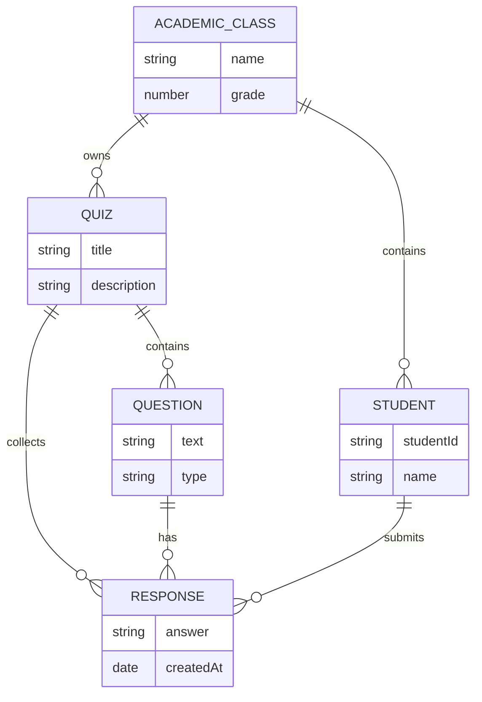

# Operation Einstein: Technical Architecture & Implementation Specification

## 1. Executive Summary

**Operation Einstein** is a full-stack Learning Management System (LMS) engineered to bridge the gap between physical paper-based assessments and digital analytics.

This document provides a deep technical rundown of the **Teacher Interface**, detailing the architectural decisions, implementation strategies, and underlying technologies that power the system. It is intended for software engineers, system architects, and maintainers.

---

## 2. Technical Stack & Implementation Strategy

The application adopts a **Modular Monolith** architecture pattern, encapsulated within a single repository but logically separated into Service (Backend) and Client (Frontend) layers.

### 2.1 Backend Layer (Node.js Runtime)

- **Runtime:** **Node.js** (v18+) selected for its non-blocking I/O model, essential for handling concurrent OCR processing tasks without stalling the main event loop.
- **Framework:** **Express.js** acts as the API Gateway. It utilizes a middleware chain pattern for Request Logging, Body Parsing (JSON), and CORS handling.
- **Image Processing:**
  - **Multer:** Middleware for `multipart/form-data` handling. It streams incoming binary data to a temporary disk storage (`/uploads`), preventing memory overflow attacks.
  - **Sharp:** High-performance Node.js image processor. Used for **server-side cropping**. It creates a buffer stream from the uploaded file, extracts the specific region defined by frontend coordinates, and pipes it directly to the OCR engine.
- **OCR Engine:** **Tesseract.js** (WASM). A WebAssembly port of the Tesseract OCR engine. It runs in a worker thread, ensuring heavy computational tasks do not block the Express HTTP request handler.

### 2.2 Frontend Layer (React / Next.js)

- **Framework:** **Next.js 14 (App Router)**.
  - **Server Components:** Used for Route Layouts and Initial Data Fetching (SEO, Performance).
  - **Client Components:** Used for interactive features (`QuestionForm`, `Scanner`, `ResponseViewer`) requiring `useState` and Browser APIs (Canvas, FileReader).
- **Styling:** **Tailwind CSS**. Utility-first CSS framework for rapid UI composition and responsive design.
- **State Management:** React Hooks (`useState`, `useEffect`, `useRef`). State is lifted to Page components to orchestrate data flow between siblings (e.g., updating the List when a Form submits).
- **Canvas Manipulation:** **React-Image-Crop**. Provides a UI layer over the HTML5 Canvas API to calculate normalization coordinates `(x, y, width, height)` relative to the image's natural dimensions.

### 2.3 Persistence Layer

- **Database:** **MongoDB** (v6+). A NoSQL document store chosen for its flexibility with varying Question structures (e.g., some have `options` arrays, others do not).
- **ODM:** **Mongoose**. Provides strict schema validation, type casting, and relationship management (via `ObjectId` references).

---

## 3. Architecture Diagrams

### 3.1 System Data Flow

This diagram illustrates the lifecycle of a "Scan & Grade" request, traversing from the user's browser through the processing pipeline to the database.



### 3.2 Database Entity-Relationship (ERD)

The schema relies on normalized references (`ObjectId`) to maintain data integrity.



---

## 4. Implementation Details (Deep Dive)

### 4.1 The OCR Coordinate Math

A critical challenge in client-side cropping is that the image displayed on screen (CSS pixels) differs from the actual image file (Natural pixels).

**Frontend Implementation:**

1.  The `` tag is rendered with `maxWidth: 100%`.
2.  We calculate a **Scale Factor**:
    ```typescript
    const scaleX = image.naturalWidth / image.width;
    const scaleY = image.naturalHeight / image.height;
    ```
3.  When the user draws a box `(x, y)`, we multiply by the scale factor before sending to the backend.

**Backend Implementation:**

1.  Receives `crop: { left, top, width, height }`.
2.  Uses `sharp(filePath).extract(crop).toFile(tempPath)`.
3.  This ensures the OCR engine only sees the high-resolution segment containing the handwriting, significantly improving accuracy compared to scanning the full page.

### 4.2 API Specification

| Endpoint           | Method | Payload / Query                             | Description                              |
| :----------------- | :----- | :------------------------------------------ | :--------------------------------------- |
| **/api/classes**   | `GET`  | -                                           | Fetch all classes.                       |
| **/api/classes**   | `POST` | `{ name, grade }`                           | Create a new class.                      |
| **/api/quizzes**   | `GET`  | `?classId=...`                              | Fetch quizzes for a specific class.      |
| **/api/quizzes**   | `POST` | `{ title, classId }`                        | Create a quiz.                           |
| **/api/questions** | `GET`  | `?quizId=...`                               | Fetch questions for a quiz.              |
| **/api/questions** | `POST` | `{ text, type, quizId }`                    | Add a question to a quiz.                |
| **/api/scan/crop** | `POST` | `FormData: image, crop`                     | **Process:** Crop -> OCR -> Return Text. |
| **/api/responses** | `POST` | `{ quizId, questionId, studentId, answer }` | Save/Update a student's grade.           |

---

## 5. Operational Guide

### 5.1 Environment Requirements

- **Docker:** Required for running the persistent MongoDB instance.
- **Node.js v18+:** Required for `fetch` API support and Sharp bindings.

### 5.2 Local Development Setup

1.  **Database Initialization:**
    Start a detached MongoDB container mapped to the standard port.

    ```bash
    docker run -d -p 27017:27017 --name mongo-einstein mongo:latest
    ```

2.  **Backend Startup:**
    Runs the Express API on **Port 5001** (Changed from 5000 to avoid MacOS AirPlay conflicts).

    ```bash
    cd teacher
    npm install
    node backend/server.js
    ```

3.  **Frontend Startup:**
    Runs the Next.js Dev Server on **Port 3000**.
    ```bash
    cd teacher/frontend
    npm install
    npm run dev
    ```

### 5.3 Validation & Testing

The project enforces strict TDD.

- **Integration Tests:** Located in `teacher/backend/tests/`.
  - Uses `mongodb-memory-server` to spin up an ephemeral database for every test suite.
  - Uses `supertest` to mock HTTP requests to the Express app.
  - **Command:** `npm test` (inside `teacher/` directory).

---

## 6. Future Technical Roadmap

- **Authentication:** Implement JWT-based auth via Passport.js or NextAuth.
- **Cloud Storage:** Replace local `/uploads` folder with AWS S3 for stateless image handling.
- **Vector Search:** Implement semantic search for analyzing open-ended student responses.
- **Student-Teacher Sync:** Integrate the Student App logic with the shared MongoDB database to enable real-time synchronization, ensuring student uploads and submissions are instantly accessible in the Teacher Interface.
